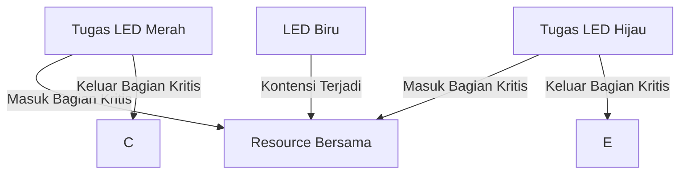

# Demonstrasi Eliminasi Kontensi Resource dengan Menonaktifkan Scheduler

## Gambaran Proyek

Proyek ini mendemonstrasikan cara sederhana untuk menghilangkan kontensi resource dengan menghentikan scheduler. Dengan menonaktifkan interupsi selama akses ke resource bersama, sistem mencegah terjadinya interferensi antara tugas.

## Deskripsi Proyek

Dalam proyek ini, dua tugas berbagi resource bersama dan menggunakan fungsi `taskENTER_CRITICAL()` serta `taskEXIT_CRITICAL()` untuk memastikan akses eksklusif ke resource. Dengan pendekatan ini, kontensi resource dapat dihilangkan sepenuhnya.

## Tugas

### 1. **Tugas LED Hijau**
   - **Deskripsi**: Menghidupkan dan mematikan LED hijau.
   - **Prioritas**: Di bawah Normal.
   - **Langkah**:
     - Hidupkan LED hijau.
     - Masuk ke bagian kritis (`taskENTER_CRITICAL()`).
     - Akses resource bersama.
     - Keluar dari bagian kritis (`taskEXIT_CRITICAL()`).
     - Matikan LED hijau.
     - Tunggu selama **500ms**.

### 2. **Tugas LED Merah**
   - **Deskripsi**: Menghidupkan dan mematikan LED merah.
   - **Prioritas**: Normal.
   - **Langkah**:
     - Hidupkan LED merah.
     - Masuk ke bagian kritis (`taskENTER_CRITICAL()`).
     - Akses resource bersama.
     - Keluar dari bagian kritis (`taskEXIT_CRITICAL()`).
     - Matikan LED merah.
     - Tunggu selama **100ms**.

### 3. **Resource Bersama**
   - **Akses**:
     - Periksa status `StartFlag`.
     - Jika `StartFlag` aktif, ubah menjadi nonaktif dan lanjutkan akses resource.
     - Jika tidak aktif, nyalakan LED biru untuk menandakan kontensi resource.
   - **Simulasi Operasi**:
     - Simulasikan akses resource dengan jeda waktu **500ms**.
   - **Reset**:
     - Matikan LED biru jika menyala.
     - Setel ulang `StartFlag` ke aktif.

## Hubungan Antar Tugas

- Tugas LED Hijau dan Merah berbagi resource bersama yang sama.
- Mekanisme eksklusi mutual melalui penonaktifan interupsi memastikan hanya satu tugas yang dapat mengakses resource pada satu waktu.

## Diagram Alur Kerja

## Hasil Perilaku LED
### 1. **Tugas LED Hijau**
  - LED hijau menyala selama 500ms saat mengakses resource bersama.
  - LED hijau padam selama 500ms sebelum kembali menyala.

### 2. **Tugas LED Merah**
  - LED merah menyala selama 100ms saat mengakses resource bersama.
  - LED merah padam selama 100ms sebelum kembali menyala.
  - 
### 3. **LED Biru**
  - LED biru tidak menyala karena kontensi resource dihilangkan melalui mekanisme eksklusi mutual.
